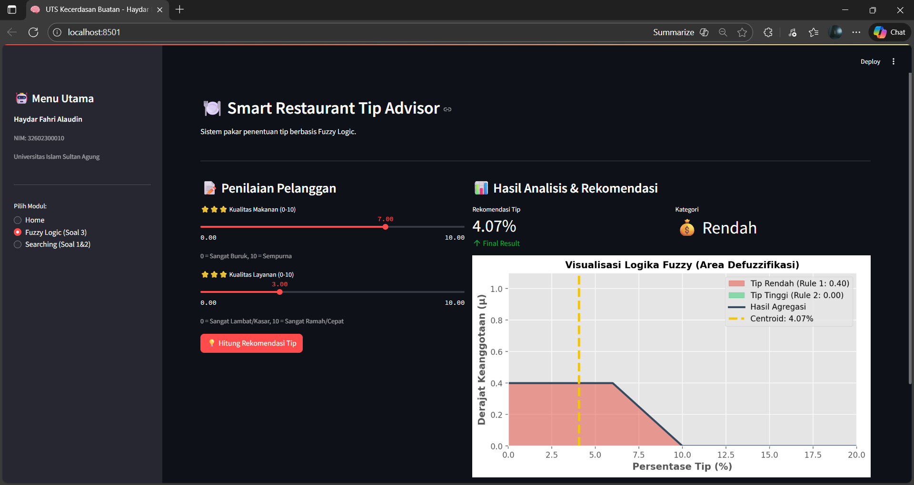
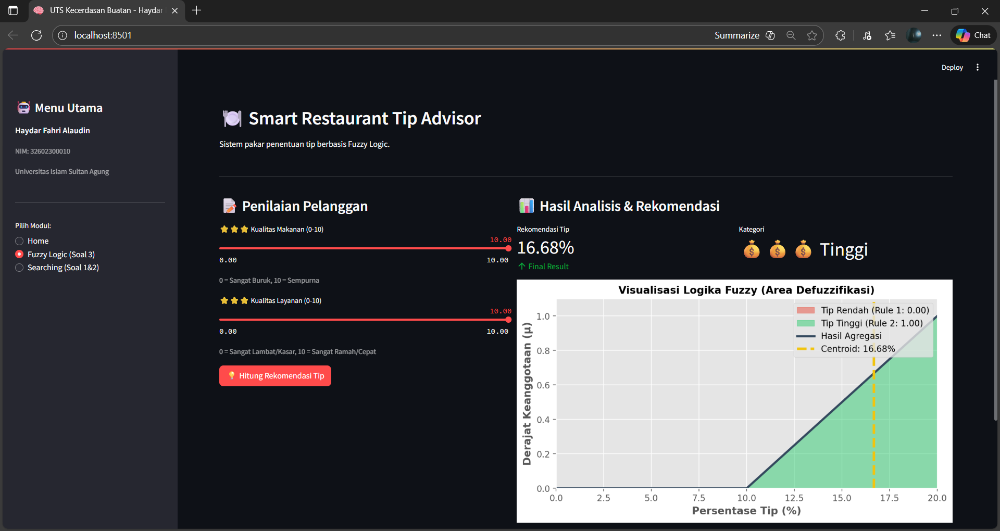
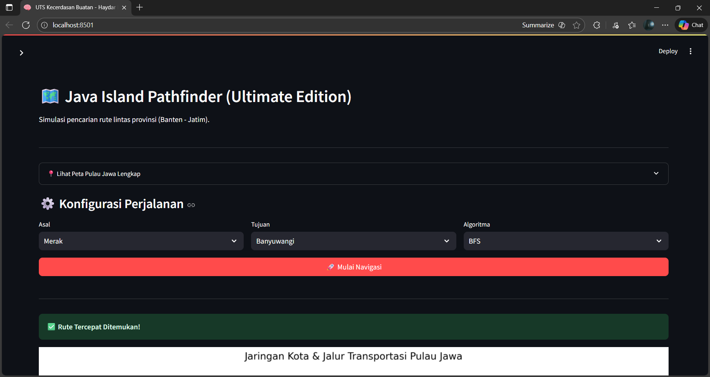
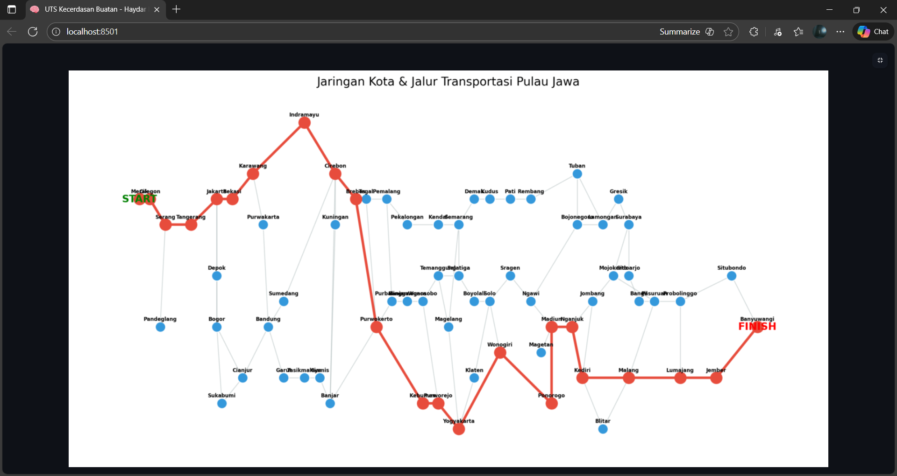
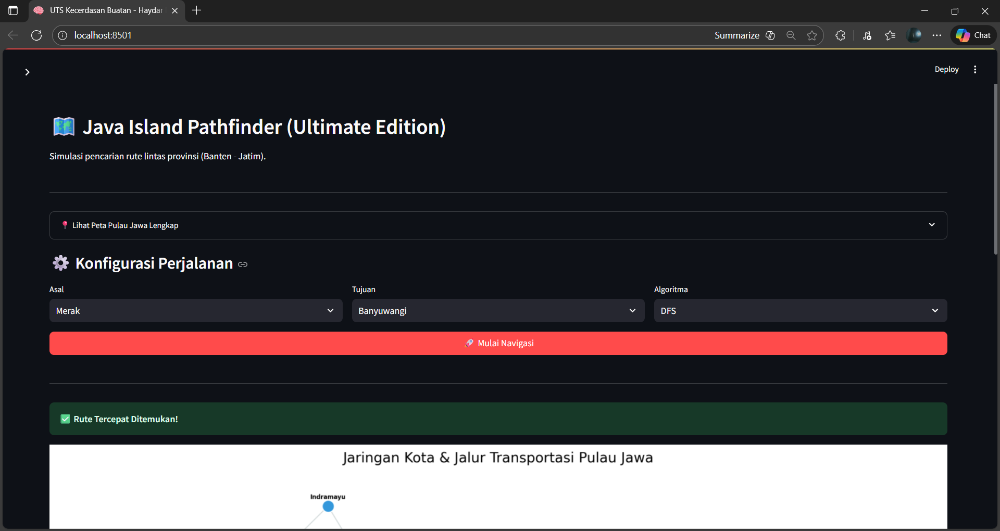
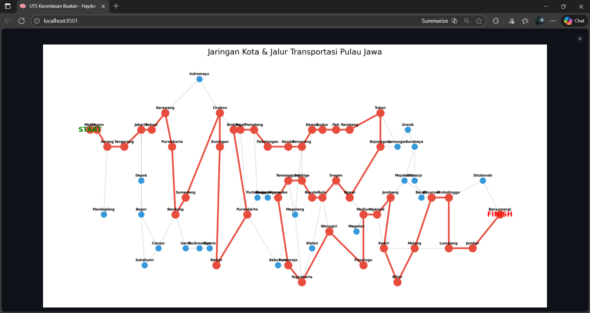
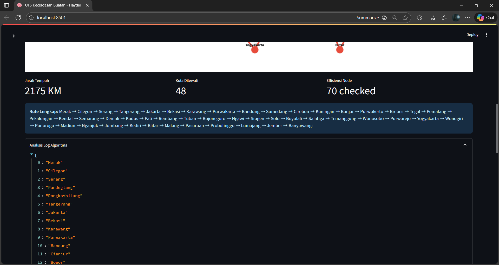
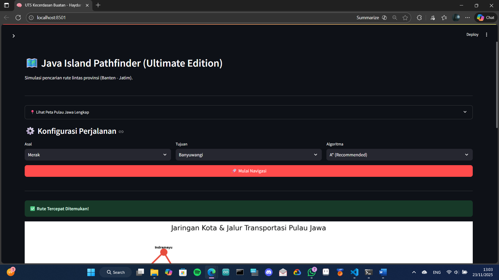
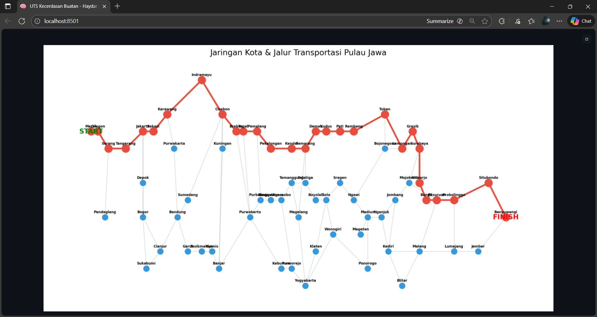

# 🧠 NEXUS OPTIMA: AI Pathfinder & Inference System

> **Repository ini disusun sebagai pemenuhan Tugas Ujian Tengah Semester (UTS) mata kuliah Kecerdasan Buatan.**

---

## 👤 Identitas Mahasiswa

* **Nama:** Haydar Fahri Alaudin
* **NIM:** 32602300010
* **Kelas:** Kecerdasan Buatan (D)
* **Prodi:** Teknik Informatika
* **Universitas:** Universitas Islam Sultan Agung

---

## 📋 Deskripsi Proyek

**Nexus Optima** adalah aplikasi berbasis web yang mengintegrasikan dua konsep utama dalam Kecerdasan Buatan:
1.  **Sistem Pakar Fuzzy (Mamdani):** Menentukan tip restoran berdasarkan kualitas makanan dan layanan.
2.  **Java Pathfinder (Searching):** Simulasi pencarian rute terpendek antar kota di Pulau Jawa menggunakan berbagai algoritma pencarian.

---

## ✅ Pemenuhan Syarat Soal (Traceability)

Berikut adalah daftar implementasi kode untuk setiap poin soal ujian:

* **[x] Identitas Mahasiswa:** Tertera di Sidebar aplikasi (`main.py`) dan dokumen ini.
* **[x] Upload ke GitHub:** Struktur project lengkap dengan dokumentasi dan dependency.
* **[x] Blind Search (Pilih 2):** Terimplementasi algoritma **BFS** dan **DFS** pada file `src/algorithms/search_algo.py`.
* **[x] Heuristic Search (Pilih 1):** Terimplementasi algoritma **A* (A-Star)** dengan heuristik jarak lurus pada file `src/algorithms/search_algo.py`.
* **[x] Soal Kasus Fuzzy (Restoran):** Logika himpunan (Food, Service, Tip) dan aturan (Rules) diimplementasikan pada `src/algorithms/fuzzy_logic.py`.
* **[x] Hitungan Manual (Soal No. 3):** Dijelaskan secara rinci di bagian bawah dokumen ini dan dibuktikan lewat simulasi aplikasi.

---

## 📸 Dokumentasi Pengujian Algoritma

Bagian ini berisi bukti tangkapan layar (screenshot) dari setiap skenario pengujian.

### A. Pengujian Modul Fuzzy Logic

#### 1. Skenario Soal Ujian (Food=7, Service=3)
Pada pengujian ini, sistem diharapkan memberikan output Tip Rendah karena pelayanan buruk.
* **Analisis:** Rule 1 (Low) aktif sebesar 0.4, sedangkan Rule 2 (High) bernilai 0.
* **Hasil Centroid:** 4.08%

#### 2. Skenario Terbaik (Food=10, Service=10)
Pengujian kondisi sempurna untuk memastikan logika High Tip bekerja.
* **Analisis:** Rule 2 (High) aktif penuh. Grafik hijau mendominasi.
* **Hasil Centroid:** > 15%

---

### B. Pengujian Modul Searching (Pathfinder)
**Rute Pengujian:** Merak ➝ Surabaya.

#### 1. Algoritma BFS (Breadth-First Search)
* **Karakteristik:** Menyebar ke segala arah (melebar) level demi level.
* **Hasil:** Menemukan rute dengan jumlah kota paling sedikit, namun total jarak (KM) seringkali tidak efisien karena tidak mempertimbangkan bobot jarak.

#### 2. Algoritma DFS (Depth-First Search)
* **Karakteristik:** Menelusuri satu jalur sedalam mungkin hingga mentok.
* **Hasil:** Sering menghasilkan rute yang sangat panjang dan berputar-putar (zig-zag) sebelum mencapai tujuan. Tidak optimal.

#### 3. Algoritma A* (A-Star) - Recommended
* **Karakteristik:** Cerdas. Menggabungkan jarak tempuh (g) dan estimasi jarak lurus ke tujuan (h).
* **Hasil:** Selalu menemukan rute dengan **Total Jarak (KM) Terpendek** dan jumlah node yang dikunjungi lebih sedikit dibanding BFS/DFS.

---

## 📝 Jawaban Manual Soal No. 3

**Soal:** Hitung berapa persen Tip jika **Food Quality = 7** dan **Service Quality = 3**.

### 1. Fuzzifikasi
* **Input Food = 7**
    * Termasuk himpunan **Good**.
    * Derajat keanggotaan: (7 - 5) / (10 - 5) = **0.4**
* **Input Service = 3**
    * Termasuk himpunan **Poor**.
    * Derajat keanggotaan: (5 - 3) / (5 - 0) = **0.4**

### 2. Inferensi (Evaluasi Aturan)
* **Rule 1 (Tip Low):** IF Service Poor OR Food Bad
    * Operator OR menggunakan MAX.
    * Alpha = max(0.4, 0) = **0.4** (Rule Aktif)
* **Rule 2 (Tip High):** IF Service Excellent AND Food Good
    * Operator AND menggunakan MIN.
    * Alpha = min(0, 0.4) = **0** (Rule Tidak Aktif)

### 3. Defuzzifikasi (Centroid)
* Daerah solusi adalah kurva segitiga **Low** yang terpotong pada tinggi **0.4**.
* Menggunakan metode *Centroid* (Titik Pusat), hasil perhitungan akhirnya adalah **4.08%**.

---

## 🚀 Cara Menjalankan Aplikasi

Ikuti langkah berikut di Terminal:

**Langkah 1: Buat Environment**

python -m venv env
.\env\Scripts\Activate

**Langkah 2: Install Library**

pip install -r requirements.txt

**Langkah 3: Jalankan Program Lewat Streamlit**

streamlit run main.py